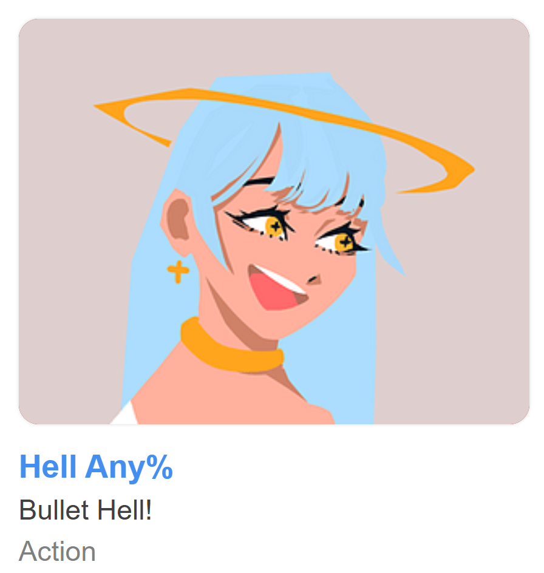

# About Me!

## Table of Contents:
- [About Me!](#about-me)
  - [Table of Contents:](#table-of-contents)
  - [Who am I?](#who-am-i)
  - [Current Projects:](#current-projects)
  - [Previous Projects](#previous-projects)
  - [Other Stuff](#other-stuff)
  - [Personal Goals (FA23 - SP25):](#personal-goals-fa23---sp25)

## Who am I?

I'm an undergraduate student currently in my final year of the Mathematics / Computer Science program at UCSD. Proponent of `cowsay`.

> "If there's one thing you take away from this course [CSE 130], let it be `cowsay`.
> 
> -Professor Ranjit Jhala, 2025

## Current Projects:

1. Undergraduate Honors Thesis - Mathematics
   - The purpose of this thesis is to explore the properties of harmonic measures on simple convex regions of the complex plane. 
   -  Much of this investigation has been centered around the ways in which the curvature of the region's boundary affects the harmonic measure, both locally and globally.
   -  For more information on Harmonic Measures, check out [**this video**](https://www.youtube.com/watch?v=Vn6jT5V9qW8).
      -  *Note: The above links to an external site (youtube.com)*
  
2. CSE 110 - Software Engineering Project
    - *More details coming soon!*

## Previous Projects

1. Tritonware FA23 - *Hell Any%*
    - A short bullet-hell game made as part of the TritonWare Game Jam in Fall 2023.
    - [Play it here!](https://kiichiw.itch.io/hell-any)
      - *Note: The above links to an external site: (itch.io)*

> An action paced bullet hell w/ powerups (intended to be a roguelike) -- made for VGDC @UCSD's 2023 Fall Tritonware!
> 
> *-Kiichi W.*

## Other Stuff

[Check out my other stuff!](otherStuff.md)

## Personal Goals (FA23 - SP25):

- [x] Make a game!
- [x] Write the soundtrack for a game.
- [x] Take an astrophysics course.
- [ ] Complete a research project (In Progress: Mathematics Thesis)
- [ ] Build my own website
- [ ] Publish first build of `untitled_platformer` (More Details Coming Soon)